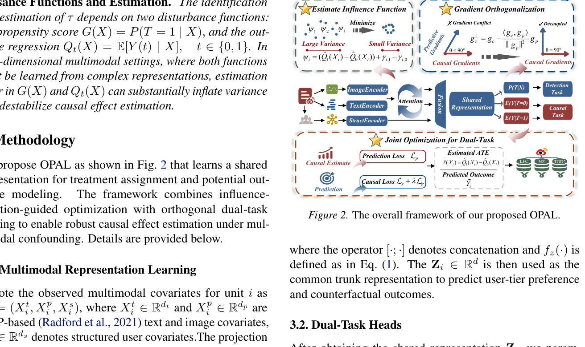

<div align="center">

# OPAL
### Orthogonal Prediction-Aware Learning for Multimodal Causal Effect Estimation

[](#)
[](https://www.python.org/)
[](https://pytorch.org/)
[](#)

**Anonymous submission — code & data release for peer review.**

</div>

OPAL estimates average treatment effects (ATE) from **text + image + structured** covariates under multimodal confounding. It jointly learns propensity and outcome heads from a shared representation, regularizes training with an influence-function (EIF) objective (**DTCO-IF**), and applies **prediction-preserving gradient orthogonalization** to reduce interference between the detection and causal tasks.

## 🔥 News

- **[2026-07]** Code and semi-synthetic multimodal datasets (Weibo LFC / NZ / TGD2 + Yelp) released for anonymous review.

## 🏗️ Method

<p align="center">
  
</p>

**Highlights**
- Multimodal encoders with cross-modal attention and fusion into a shared representation $Z_i$
- Dual-task heads for propensity $P(T \mid X)$ and potential outcomes $E[Y \mid T=0/1]$
- Influence-score regularization to stabilize doubly robust / EIF-based estimation
- Gradient orthogonalization that preserves predictive updates while projecting causal gradients

## 🚀 Installation

```bash
git clone https://github.com/swufe-NiceLab-GeoText/OPAL.git
cd OPAL
pip install -r requirements.txt
```

Requires `torch>=2.0` and `numpy>=1.21`. A CUDA GPU is recommended for training.

## 📦 Datasets

Semi-synthetic multimodal packs are provided under `data/`:

| Dataset | File | Source |
|---------|------|--------|
| LFC (Fallen City) | `data/lfc.pkl` | Weibo-derived |
| NZ (Nezha) | `data/nz.pkl` | Weibo-derived |
| TGD2 (Special Forces 2) | `data/tgd2.pkl` | Weibo-derived |
| Yelp | `data/yelp.pkl.gz` | Yelp-derived (fp16 features + gzip) |

Each file contains 512-d CLIP text/image embeddings, structured attributes, binary treatment `T`, observed outcome `Y`, and ground-truth quantities for ATE evaluation. For Yelp, cast float16 feature matrices back to float32 after loading if needed.

## ▶️ Quick Start

```python
import pickle
import gzip
import torch

from opal_model import OPAL
from opal_loss import DTCOIFLoss
from trainer import OPALTrainer
from config import TRAIN_CONFIG, DTCOIF_CONFIG, set_seed, DEVICE

set_seed(42)

# Weibo pack
with open("data/nz.pkl", "rb") as f:
    data = pickle.load(f)

# Yelp pack (gzip + fp16 features)
# with gzip.open("data/yelp.pkl.gz", "rb") as f:
#     data = pickle.load(f)
#     for k in ("textual_features", "visual_features", "structured_features"):
#         data["X"][k] = data["X"][k].astype("float32")

model = OPAL(...).to(DEVICE)  # see opal_model.py / config.py
criterion = DTCOIFLoss(**DTCOIF_CONFIG)
trainer = OPALTrainer(model, criterion, TRAIN_CONFIG, device=DEVICE)
# trainer.fit(train_loader, val_loader)
```

Default hyperparameters are in `config.py` (`TRAIN_CONFIG`, `DTCOIF_CONFIG`).

## 📊 Repository Layout

```
├── assets/
│   └── framework.png    # Overall framework figure
├── encoders.py          # ModalityEncoder, CrossModalAttention
├── opal_model.py        # OPAL
├── opal_loss.py         # DTCO-IF loss
├── trainer.py           # Orthogonal dual-task training
├── config.py            # Hyperparameters
├── requirements.txt
└── data/
    ├── lfc.pkl
    ├── nz.pkl
    ├── tgd2.pkl
    └── yelp.pkl.gz
```

## 📄 License & Anonymity

This repository is released **solely for anonymous peer review**. Please do not attempt to deanonymize the authors during the review period. Public identity and citation information will be added after acceptance and disclosure.

---

*Code release accompanying an anonymous manuscript under review.*
