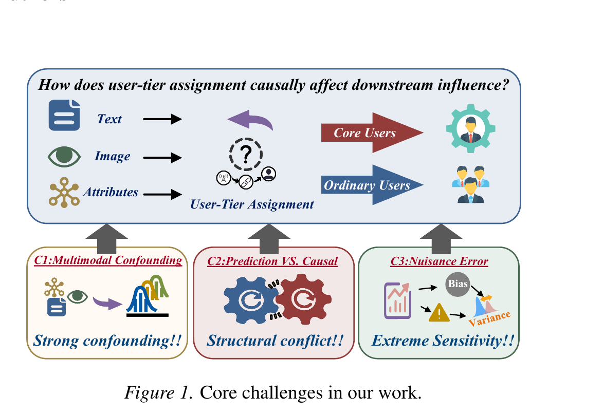
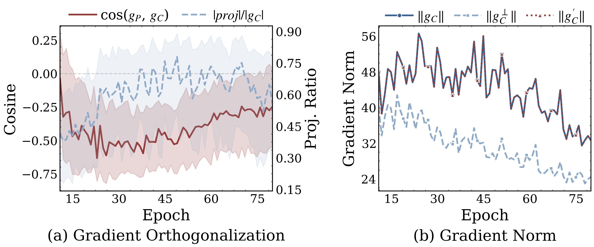
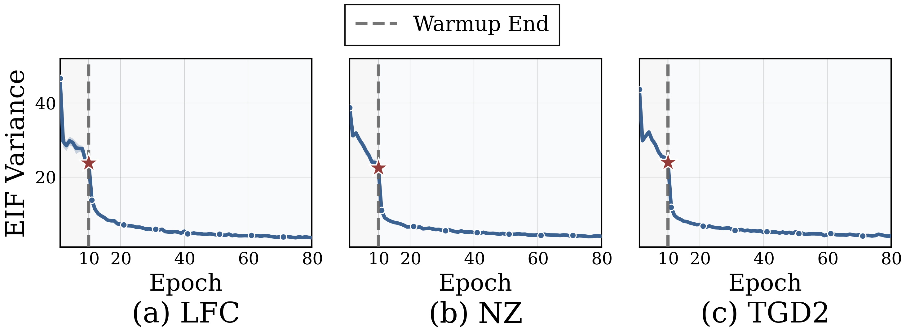

# OPAL: Estimating Causal Effects with Orthogonal Prediction-Aware Learning


<p align="center">
  
</p>

> **TL;DR** — **OPAL** estimates the Average Treatment Effect (ATE) under **high-dimensional multimodal confounding**. It (i) learns a shared cross-modal representation, (ii) minimizes the variance of a doubly-robust **Efficient Influence Function (EIF)** objective, and (iii) **orthogonalizes** predictive and causal gradients so that improving prediction never destabilizes causal estimation. On three real-world multimodal benchmarks OPAL cuts ATE error by **≈4.7×** over the strongest baseline while staying lightweight (**1.1M** parameters).

This repository accompanies the paper *Estimating Causal Effects with Orthogonal Prediction-Aware Learning* and hosts the three semi-synthetic multimodal benchmarks (LFC / NZ / TGD2) used in our experiments.

## Motivation

Estimating causal effects from **multimodal** observational data (text, image, structured attributes) is fragile in practice. We identify three coupled challenges:

<p align="center">
  
</p>

- **C1 — Multimodal confounding.** Treatment assignment and outcomes are jointly driven by rich, high-dimensional cross-modal signals, so propensity and outcome models must be learned from *representations* rather than observed covariates.
- **C2 — Structural conflict between prediction and causal goals.** A single shared representation optimized for both objectives induces gradient interference, destabilizing training and distorting the causal estimate.
- **C3 — Extreme sensitivity to nuisance error.** Small errors in the estimated propensity / outcome functions propagate into large biases and variance in the effect estimate.

OPAL targets all three at once.

## Method

OPAL couples multimodal representation learning with semiparametrically-efficient causal estimation through three ideas:

- **Multimodal representation with cross-modal attention.** Text, image, and structured attributes are projected and fused with symmetric cross-modal attention, capturing interaction-induced confounding in a shared representation used for both treatment and outcome modeling.
- **Influence-function-guided objective.** Rather than a plain plug-in estimator, OPAL minimizes the variance of a doubly-robust efficient-influence-function (EIF) objective, aligning training with semiparametric efficiency and hardening the estimate against nuisance error.
- **Gradient orthogonalization.** Predictive and causal gradients on the shared representation are decoupled (with a norm clamp), so improving prediction does not distort — or destabilize — the causal estimate.

The target estimand is the ATE, `τ = E[Q1(X) − Q0(X)]`.

## Datasets

Three semi-synthetic multimodal benchmarks, each built from real-world multimodal posts with a **known ground-truth ATE** (512-d CLIP text/image embeddings + structured attributes), so that estimation error can be measured exactly.

| Dataset | # Samples | Text dim | Image dim | Struct dim | Treated ratio | True ATE |
|---|---:|---:|---:|---:|---:|---:|
| **LFC**  | 8,892  | 512 | 512 | 23 | 0.53 | 2.185 |
| **NZ**   | 18,275 | 512 | 512 | 23 | 0.55 | 2.225 |
| **TGD2** | 15,845 | 512 | 512 | 34 | 0.53 | 2.171 |

## Results

### ATE estimation error

Absolute ATE error `|ATE_hat − ATE_true|` (lower is better), averaged over 3 seeds.

| Method | LFC | NZ | TGD2 | **Avg** |
|---|---:|---:|---:|---:|
| OLS            | 3.244 | 3.357 | 3.150 | 3.250 |
| DragonNet      | 2.540 | 1.946 | 2.375 | 2.287 |
| CFRNet         | 1.947 | 0.746 | 0.906 | 1.199 |
| TARNet         | 1.222 | 0.950 | 0.971 | 1.048 |
| TransTEE       | 0.715 | 0.274 | 0.535 | 0.508 |
| **OPAL (ours)** | **0.037** | **0.218** | **0.069** | **0.108** |

### Ablation

Average ATE error when each component is removed — the influence-function objective and cross-modal attention are the most critical.

| Variant | Avg ATE error |
|---|---:|
| **OPAL (full)** | **0.108** |
| − overlap weighting            | 0.261 |
| − gradient orthogonalization   | 0.425 |
| − cross-modal attention        | 1.014 |
| − propensity head              | 1.045 |
| − EIF-variance loss            | 2.152 |

### Efficiency

OPAL is compact and fast: **~1.13M** parameters (**4.3 MB**), **0.014 ms/sample** inference — on par with the lightest baselines while being far more accurate.

### Training dynamics

<p align="center">
  
</p>

*Predictive and causal gradients are persistently in conflict (cosine `< 0`). OPAL removes the conflicting projection and a norm clamp keeps the causal-gradient magnitude stable throughout training.*

<p align="center">
  
</p>

*Once the EIF-variance objective is activated (after a 10-epoch warmup), the influence-function variance drops sharply and stays low on all three datasets, yielding efficient ATE estimates.*

## Citation

```bibtex
@misc{opal,
  title  = {Estimating Causal Effects with Orthogonal Prediction-Aware Learning},
  author = {Anonymous},
  year   = {2026},
}
```

## License

Released for academic research use.
